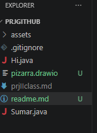

# prj inicial

## estruct. de prj

Proyecto/
│
├── assets/                # Carpeta para recursos (imágenes, estilos, etc.)
│
├── .gitignore             # Archivo de configuración para Git, define qué no se versiona
│
├── Hi.java                # Archivo fuente en Java (probablemente clase de prueba o ejemplo)
│
├── Sumar.java             # Archivo fuente en Java (posiblemente lógica de suma)
├── pizarra.drawio         # Diagrama visual (modelo, arquitectura o flujo)
│
├── prj1class.md           # Documento en Markdown (explicación de clases o diseño)
│
├── readme.md              # **Documento** principal del proyecto, instrucciones y descripción
│

*image* en **negrita**

